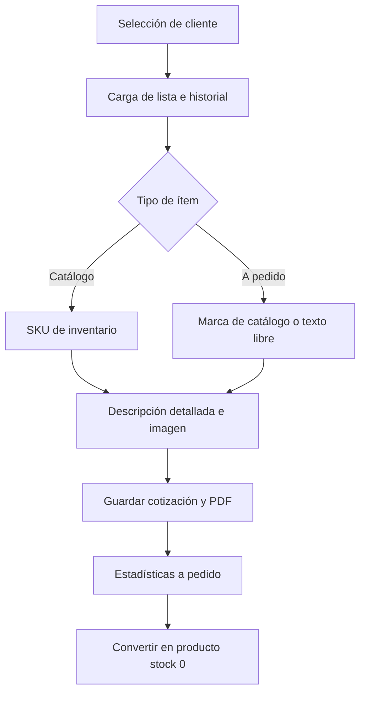
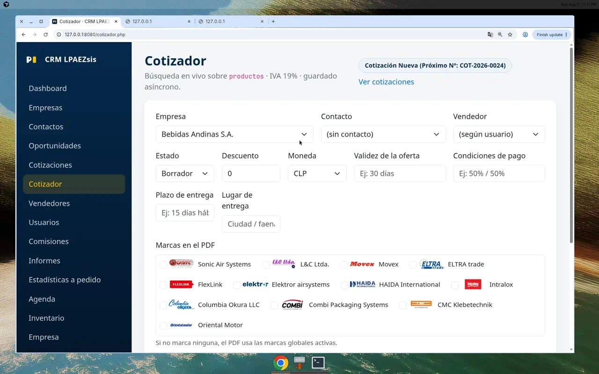
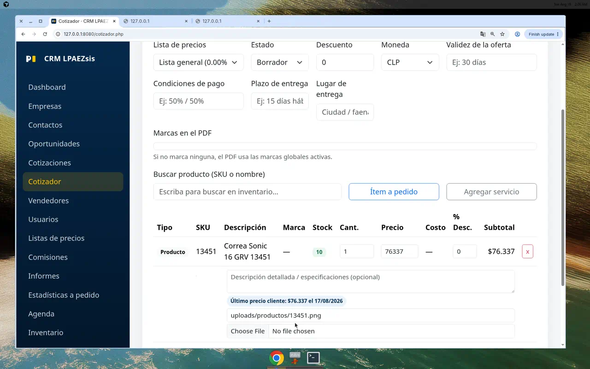
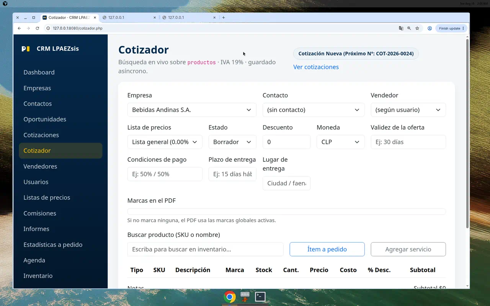
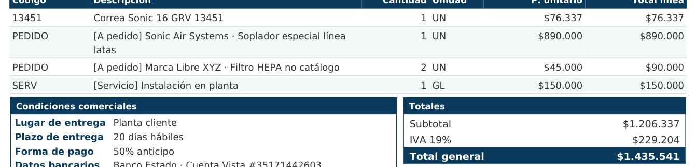
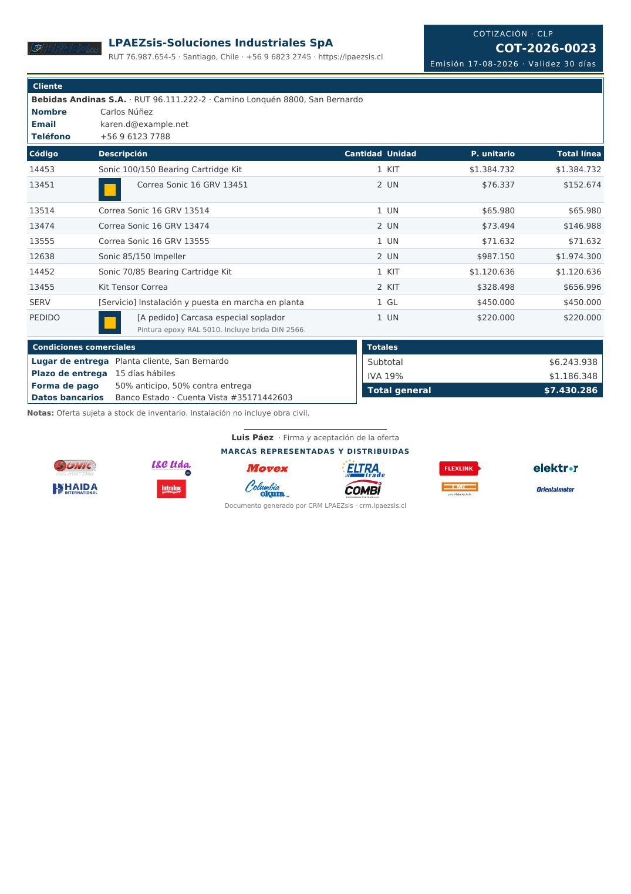
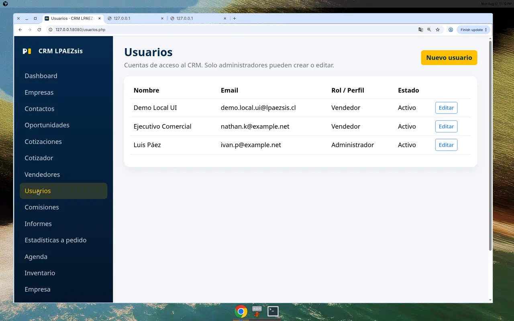
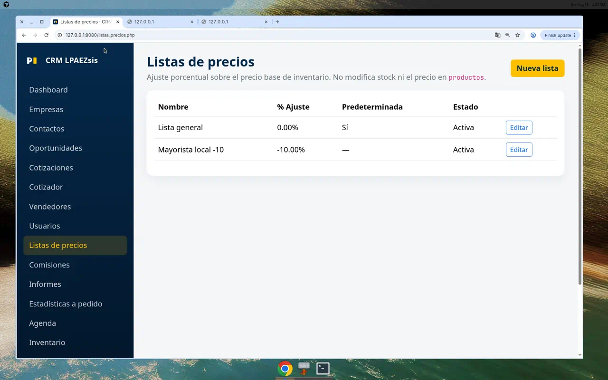

# Manual de usuario — CRM LPAEZsis

**Producto:** CRM Industrial Omnicanal B2B  
**URL de producción:** https://crm.lpaezsis.cl  
**Audiencia:** vendedores, administradores y stakeholders  
**Versión del documento:** 2026-08-18  

Las pantallas de este CRM viven en la **raíz del sitio** (`cotizador.php`, `usuarios.php`, `listas_precios.php`, `estadisticas_a_pedido.php`). No existe una carpeta `vistas/`.

---

## 1. Introducción y arquitectura

### 1.1 Propósito comercial

CRM LPAEZsis es el sistema de venta B2B de **LPAEZsis** para cotizar maquinaria, recambios y servicios industriales. Centraliza:

- la ficha del cliente (empresa, contacto, vendedor);
- la **fijación de precio por cliente** (lista porcentual + último precio cotizado);
- el **cotizador vivo** sobre inventario real;
- los **ítems a pedido** (demanda fuera de catálogo, con marca, costo, foto y PDF);
- la conversión de esa demanda en SKU de catálogo **sin inflar stock**.

El objetivo comercial es dejar de cotizar “en el aire”: cada propuesta nace con folio correlativo, precio defendible y rastro de margen.

### 1.2 Control de accesos por rol

| Rol | Perfil en pantalla | Qué puede hacer | Qué no puede hacer |
|---|---|---|---|
| **Vendedor** | Vendedor | Cotizar, empresas, pipeline, agenda, inventario (lectura), estadísticas a pedido (lectura + convertir si la API lo permite según perfil) | Administrar usuarios ni listas de precios |
| **Administrador** | Administrador | Todo lo del vendedor **más** `usuarios.php` y `listas_precios.php` | Degradar o desactivar al **último** administrador activo |

Las contraseñas se guardan con `password_hash` (nunca en texto plano). Un usuario inactivo no inicia sesión.

### 1.3 Stack tecnológico

- **PHP 7.4 LTS** (BlueHosting / cPanel). Sin sintaxis de PHP 8+.
- **PDO MySQL** en producción (`crm_*`); SQLite solo en laboratorio local.
- UI: Bootstrap 5 + JavaScript (`fetch`).
- PDF de cotización y de este manual: **Dompdf**.
- Inventario: tabla `productos` en **solo lectura**, salvo el alta autorizada de un SKU nuevo con **stock 0** (`APD-YYYY-NNNN`).

---

## 2. Flujo operativo de venta

1. **Selección de cliente.** En `cotizador.php` se elige la empresa. El contacto y el vendedor se completan a partir de esa ficha.
2. **Carga de lista / historial.** El selector **Lista de precios** toma la lista de la empresa (o la predeterminada del sistema). Al agregar un SKU de catálogo, el motor consulta `api/precios.php`.
3. **Productos de catálogo.** Búsqueda en vivo sobre `productos`. El precio se resuelve en este orden: último precio cotizado al cliente (excepto cotizaciones `rechazada` / `vencida`) → porcentaje de la lista → precio base de inventario.
4. **Ítems a pedido.** Botón **Ítem a pedido**: no hay recálculo automático. El vendedor indica marca, costo, precio, foto y texto.
5. **Descripciones e imágenes.** Cada línea admite descripción detallada y miniatura (URL o archivo PNG/JPEG).
6. **PDF.** `api/cotizacion_pdf.php` genera la propuesta corporativa: miniatura 28 px, observaciones en gris, distintivo `[A pedido]`.
7. **Estadísticas y conversión.** `estadisticas_a_pedido.php` agrupa demanda, margen y conversión. **Convertir en producto** da de alta el SKU con stock 0; **no** actualiza filas ni stock existentes.

---

## 3. Guía para el perfil Vendedor

### 3.1 Cotizador y badge de próximo folio

Pantalla: `cotizador.php`.

En una cotización **nueva** el badge muestra:

`Cotización Nueva (Próximo Nº: COT-2026-XXXX)`

Ese número es un **peek**: se consulta el correlativo (`Codes::peek`) **sin reservarlo**. El folio se asigna solo al **guardar**. Si dos vendedores abren el cotizador al mismo tiempo pueden ver el mismo próximo número; el primero en guardar se queda con él y el segundo recibe el siguiente.

Cuando la cotización ya existe, el badge pasa al folio asignado (`COT-2026-0001`, etc.).

### 3.2 Lógica de precios: lista del cliente y último precio cotizado

Al elegir empresa, el cotizador carga su `lista_precio_id` (o la lista default **Lista general 0%**).

Al agregar un **SKU de catálogo**:

| Prioridad | Origen | Badge en pantalla |
|---|---|---|
| 1 | Última cotización del mismo cliente + producto (no rechazada ni vencida) | **Último precio cliente: $… el DD/MM/AAAA** |
| 2 | `%` de la lista activa sobre el precio base | `Lista Nombre: +5%` o `-10%` |
| 3 | `productos.precio_unitario` | (sin badge) |

Los ítems **a pedido** y **servicio** no pasan por esta jerarquía: el vendedor escribe el precio.

La lista **no modifica** el stock ni el precio almacenado en inventario.

### 3.3 Ítems a pedido

Botón **Ítem a pedido** en el cotizador:

- **Marca:** selector del catálogo de marcas **o** texto libre (“Otra / escribir”).
- **Costo unitario:** base para el margen en estadísticas (el cliente no lo ve en el PDF).
- **Precio unitario:** lo que se cotiza.
- **Miniatura e imagen:** archivo PNG/JPEG o URL. Se guarda en `uploads/cotizacion_items/`.
- **Descripción detallada:** especificaciones técnicas; en el PDF se imprimen en gris bajo el título de la línea.

### 3.4 Impresión PDF de la cotización

Desde la cotización guardada se descarga el PDF corporativo (Dompdf):

- Miniatura del ítem a **28 × 28 px**.
- Observaciones / descripción detallada en **gris** (`#666`).
- Prefijo **`[A pedido]`** (y la marca, si hay) en la descripción.
- Servicios llevan el prefijo `[Servicio]`.
- Pie con las marcas representadas seleccionadas para esa propuesta.

---

## 4. Guía para el perfil Administrador

Los menús **Usuarios** y **Listas de precios** solo aparecen si `rol === admin`.

### 4.1 Gestión de usuarios (`usuarios.php`)

- **Crear:** nombre, email (login), contraseña (mín. 8), rol `vendedor` / `admin`, estado activo.
- **Editar:** mismos campos; la contraseña vacía conserva el hash actual.
- **Deshabilitar:** `activo = 0`. No elimina el histórico de cotizaciones.
- **Hash:** `password_hash` / `password_verify`.
- **Regla de seguridad:** no se puede quitar el rol admin ni desactivar al último administrador activo.

### 4.2 Listas de precios (`listas_precios.php`)

Cada lista tiene:

- nombre;
- **porcentaje de ajuste** (+ recargo / − descuento) sobre el precio base de inventario;
- marca **predeterminada** (solo una);
- estado activa / inactiva.

La lista se asigna por empresa (ficha o modal de `empresas.php` / `empresa.php`). El cotizador la hereda al elegir el cliente. **No** reescribe `productos.precio_unitario` ni el stock.

### 4.3 Estadísticas de ítems a pedido (`estadisticas_a_pedido.php`)

KPIs del período (mes / trimestre / año), filtrables por marca:

- ítems cotizados y ganados;
- monto cotizado y ventas efectivas;
- **conversión**;
- **margen promedio** (precio vs. costo unitario).

El ranking muestra **top por marca**. En sugerencias de alta, el botón **Convertir en producto**:

- inserta un SKU nuevo en `productos` con código `APD-YYYY-NNNN` (si no se indica otro);
- **stock inicial 0**;
- **nunca** hace `UPDATE` de stock sobre filas ya existentes.

---

## 5. Cómo descargar este manual en PDF

- **GitHub (sin login):** [docs/CRM_LPAEZsis_Manual_Usuario.pdf](https://github.com/lpaezsiss-sys/AUTO_OPERACIONES/raw/cursor/crm-industrial-omnicanal-fa62/docs/CRM_LPAEZsis_Manual_Usuario.pdf)
- **En la app:** con sesión, menú **Manual** → **Descargar Manual en PDF** (`api/manual_pdf.php`, Dompdf).

---

## Anexo A — Guion de video promocional para inversionistas (90 s)

**Pieza:** pitch de producto, locución en español (neutro / Chile).  
**Pantalla:** `https://crm.lpaezsis.cl` (o laboratorio local).  
**Duración total:** 1:30.

### Acto 1 — El problema `[0:00 – 0:20]`

**Locución:**  
En la venta industrial, el margen se pierde en dos sitios: cotizaciones informales de equipos especiales —WhatsApp, Excel, memoria del vendedor— y un precio distinto para cada cliente sin registro. El último descuento se vuelve el nuevo piso. El producto a pedido no deja rastro de demanda. El inventario se infla “por si acaso”.

**En pantalla:** dashboard con pipeline; corte a una cotización hecha “a mano”.

### Acto 2 — La solución comercial `[0:20 – 0:55]`

**Locución:**  
CRM LPAEZsis pone un cotizador inteligente frente al vendedor. Elige el cliente y la lista de precios se carga sola. Agrega un SKU y, en milisegundos, aparece el **último precio cotizado** a esa empresa —o el recargo de su lista—. Si el ítem no está en catálogo, lo carga **a pedido**: marca, costo, foto. El PDF sale con miniatura, observaciones en gris y el sello `[A pedido]`. Folio correlativo, sin pelearse el número.

**En pantalla (demo, ~35 s):**

1. Abrir cotizador → badge `Cotización Nueva (Próximo Nº: COT-2026-XXXX)`.
2. Elegir cliente → lista **Lista general** (o la asignada).
3. Buscar SKU → badge **Último precio cliente**.
4. **Ítem a pedido** → marca + imagen.
5. Abrir PDF → miniatura 28 px y `[A pedido]`.

### Acto 3 — Inteligencia de negocio y retorno `[0:55 – 1:20]`

**Locución:**  
Cada línea a pedido alimenta el panel de estadísticas: monto, margen, conversión, top marcas. Cuando la demanda se confirma, **Convertir en producto** crea el SKU con stock cero. Catálogo que crece con el mercado, no con sobre-stock. Menos capital inmovilizado, más visibilidad de qué se está vendiendo fuera de lista.

**En pantalla:** `estadisticas_a_pedido.php` (KPIs + botón Convertir).

### Cierre pitch `[1:20 – 1:30]`

**Locución:**  
Usuarios por rol —admin y vendedor—, PHP 7.4 LTS y MySQL en una arquitectura liviana, lista para la nube. Control comercial, sin inflar el inventario. CRM LPAEZsis. crm.lpaezsis.cl.

**En pantalla:** logo LPAEZsis + URL. Fundido.

### Ficha técnica de producción

| Campo | Valor |
|---|---|
| Duración | 90 segundos |
| Relación | 16:9 |
| Audio | Locución + música instrumental baja (industrial / corporativo) |
| CTA final | Agendar demo · crm.lpaezsis.cl |
| Restricción | No mostrar `.env`, passwords ni stock editable |

---

## Anexo B — Referencia rápida de URLs

| Recurso | Ruta |
|---|---|
| Login | `login.php` |
| Cotizador | `cotizador.php` |
| Cotizaciones | `cotizaciones.php` |
| Usuarios (admin) | `usuarios.php` |
| Listas de precios (admin) | `listas_precios.php` |
| Estadísticas a pedido | `estadisticas_a_pedido.php` |
| Este manual | `manual.php` |
| PDF del manual | `api/manual_pdf.php` |
| Health | `api/health.php` |
